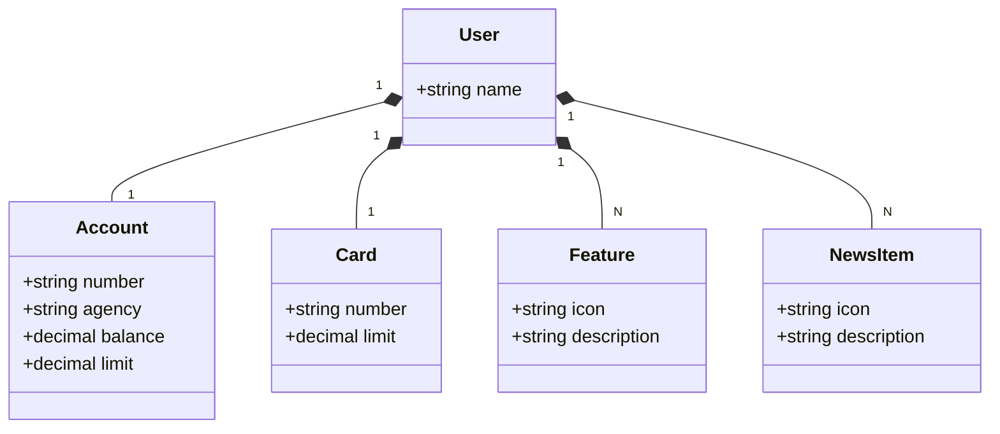

# Bootcamp Santander Backend Java

Java RESTful API desenvolvida no Bootcamp Santander Backend Java

```mermaid
classDiagram
class User {
  +string name
}

class Account {
  +string number
  +string agency
  +decimal balance
  +decimal limit
}

class Feature {
  +string icon
  +string description
}

class Card {
  +string number
  +decimal limit
}

class NewsItem {
  +string icon
  +string description
}

User "1" *-- "1" Account
User "1" *-- "1" Card
User "1" *-- "N" Feature
User "1" *-- "N" NewsItem
```
