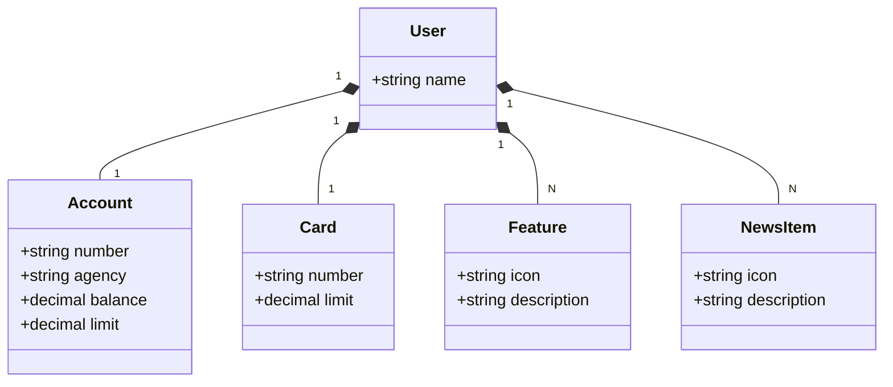

# Bootcamp Santander Backend Java

Java RESTful API desenvolvida no Bootcamp Santander Backend Java

# REST API DIO Lab

Java RESTful API desenvolvida durante o **Bootcamp Santander Backend Java** em parceria com a **DIO**, com foco em aprendizado de criação de APIs, boas práticas e persistência de dados em memória.

## Tecnologias utilizadas

- Java 17+
- Spring Boot
- Spring Web (Spring MVC)
- Spring Data JPA
- Banco de dados H2 (em memória)
- Maven
- Git e GitHub

## Objetivo do projeto

Este projeto foi criado para praticar:

- Criação de endpoints RESTful
- Modelagem e relacionamento de entidades
- Persistência de dados com Spring Data JPA
- Uso de banco H2 em memória para facilitar testes e estudos
- Organização de código seguindo boas práticas de arquitetura

## Como executar o projeto

1. Clone o repositório:
`git clone https://github.com/joilsonmslopes/rest-api-dio-lab.git`

2. Acesse a pasta do projeto:
`cd rest-api-dio-lab`

3. Execute a aplicação com Maven (ou pela sua IDE):
`mvn spring-boot:run`

4. A API ficará disponível em:
- `http://localhost:8080`

## Banco de dados H2

- Console H2 (se habilitado no `application.properties`):
- URL: `http://localhost:8080/h2-console`
- Driver: `org.h2.Driver`
- JDBC URL: `jdbc:h2:mem:testdb` (ou conforme configurado)
- Usuário/Senha: conforme configuração do projeto

## Próximos passos

- Adicionar mais endpoints e regras de negócio
- Implementar testes automatizados
- Integrar com um banco de dados relacional externo
- Evoluir o projeto para um ambiente de deploy em nuvem
